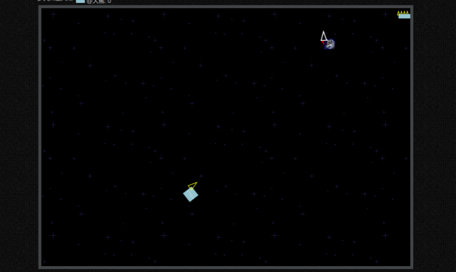

# demo-js-starwars HTML5-太空大战

demo-js-starwars 是一个基于wilddog JavaScript SDK实现的多人实时对战游戏。可以匿名对战，也可以使用微信账号登陆，以便于在积分排行榜上留名。

## 在线示例

http://starwars.wilddogapp.com/

[](http://starwars.wilddogapp.com/)


## 本地运行

可以直接用浏览器访问index.html。但是本地file://的方式只能匿名游戏，无法进行微信账号登陆。

要使用微信账号登陆，需要启动http服务器。这里推荐使用python的SimpleHttpServer：

需要安装python。

在windows命令行或linux/mac的terminal中进入目录：

```
cd demo-js-starwars/app
```

启动http服务：

```
python -m SimpleHTTPServer 8080
```

访问浏览器地址: http://127.0.0.1:8080/ 。

## 更多示例

这里分类汇总了 WildDog平台上的示例程序和开源应用，　链接地址：[https://github.com/WildDogTeam/wilddog-demos](https://github.com/WildDogTeam/wilddog-demos)

## 相关文档

* [Wilddog 概览](https://z.wilddog.com/overview/introduction)
* [JavaScript SDK快速入门](https://z.wilddog.com/web/quickstart)
* [JavaScript SDK API](https://z.wilddog.com/web/api)
* [下载页面](https://www.wilddog.com/download/)
* [Wilddog FAQ](https://z.wilddog.com/questions)

## License
MIT
http://wilddog.mit-license.org/

## 感谢 Thanks

demo-js-starwars is built on and with the aid of several  projects. We would like to thank the following projects for helping us achieve our goals:

Open Source:

* [HTML5-Asteroids](https://github.com/dmcinnes/HTML5-Asteroids) A Pure Javascript Asteroids Game.
* [JQuery](http://jquery.com) The Write Less, Do More, JavaScript Library.
